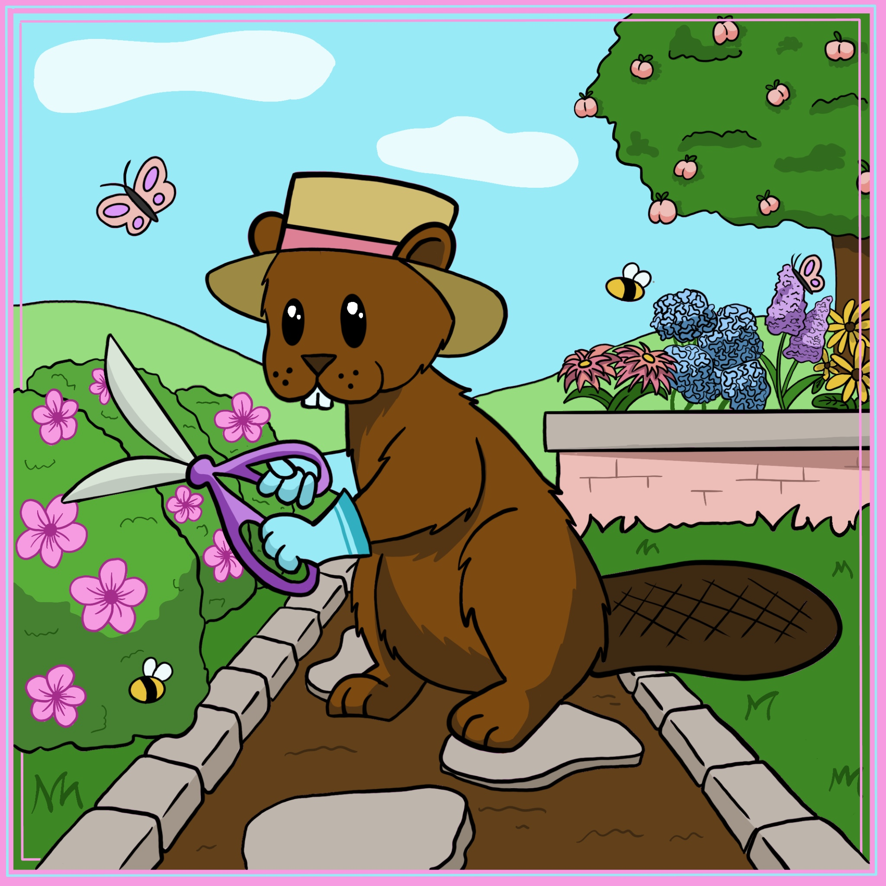
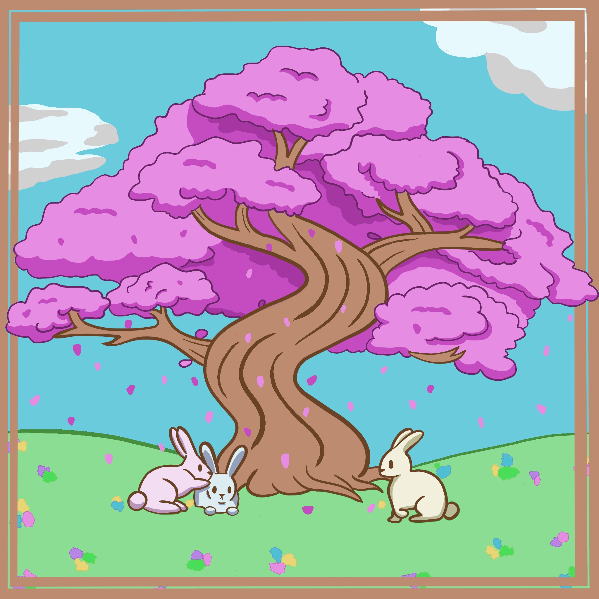
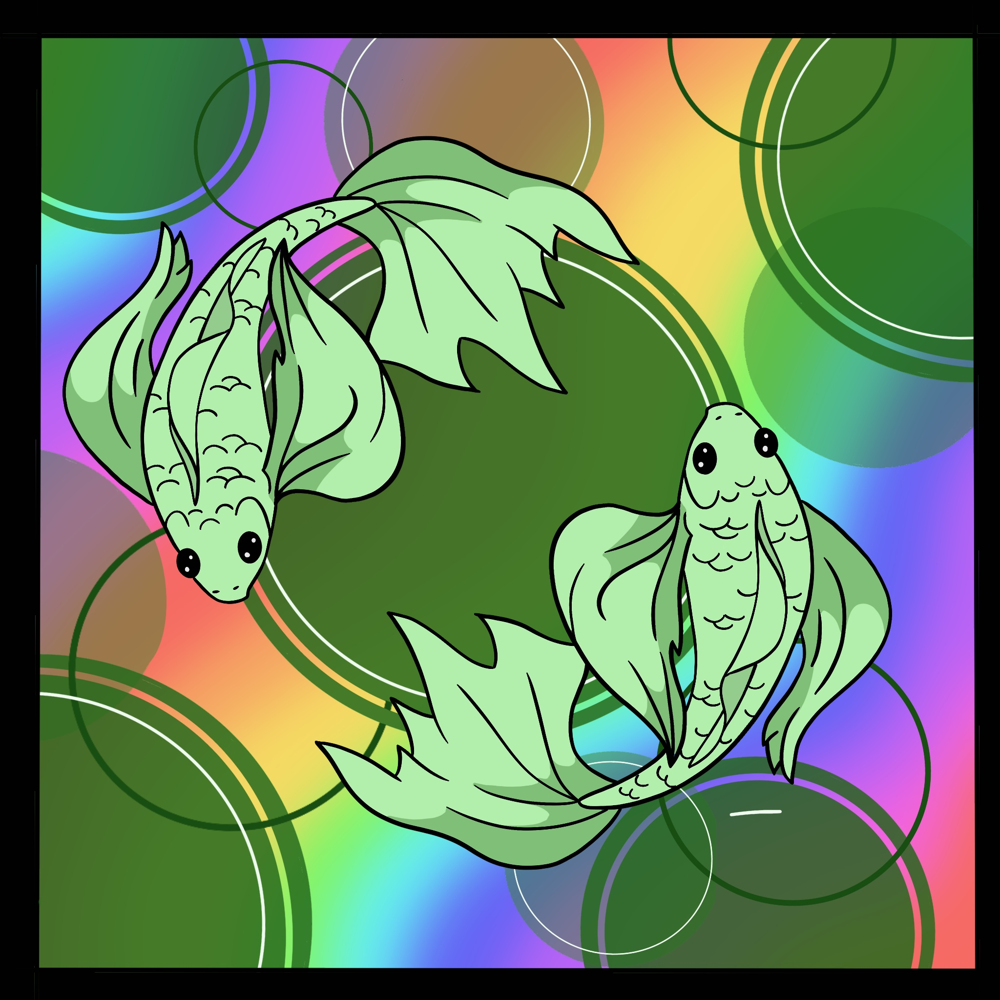
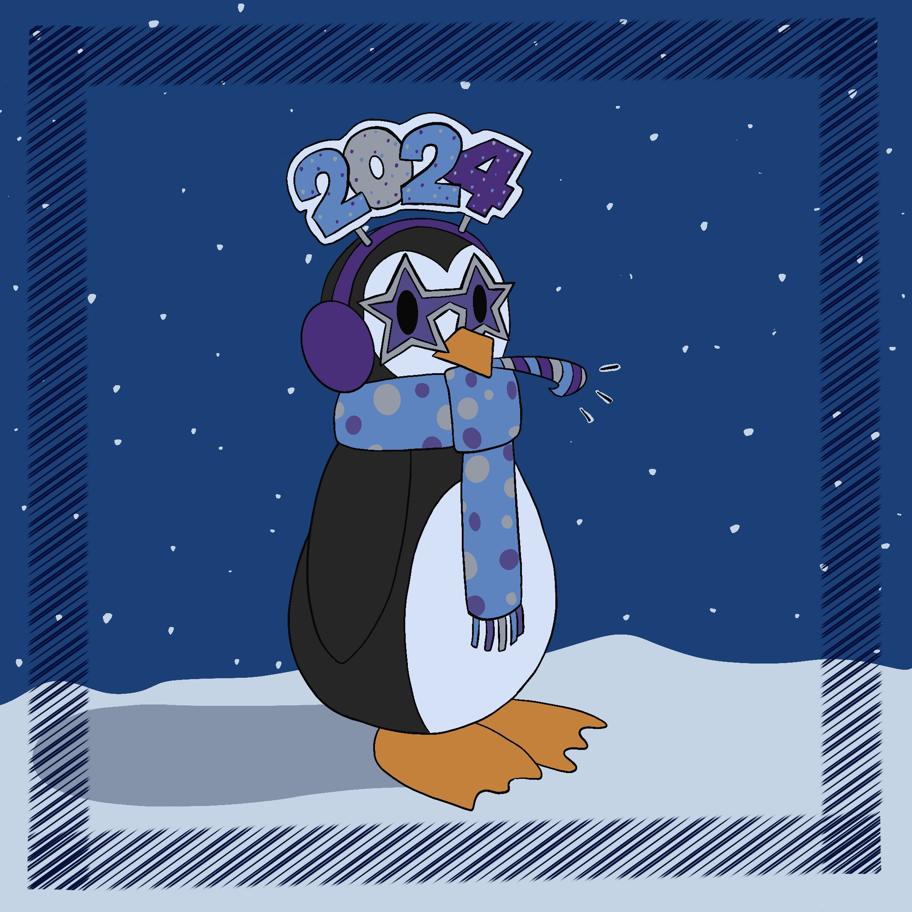
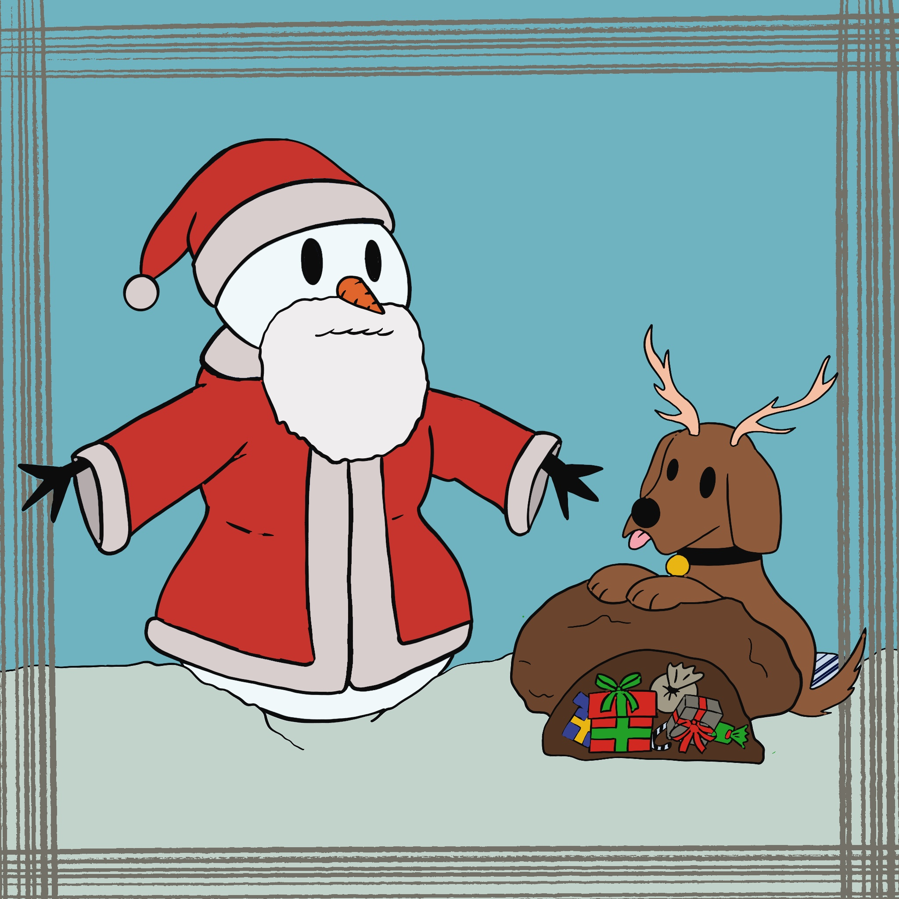
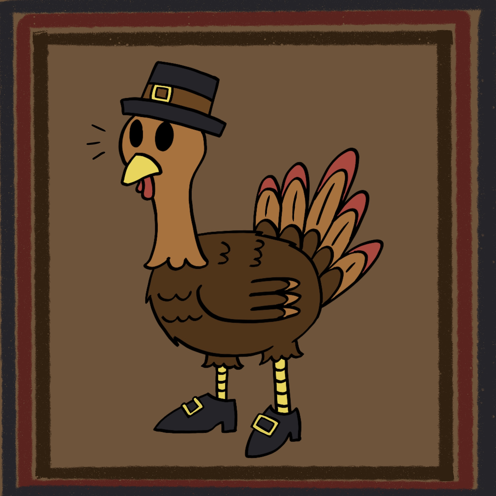
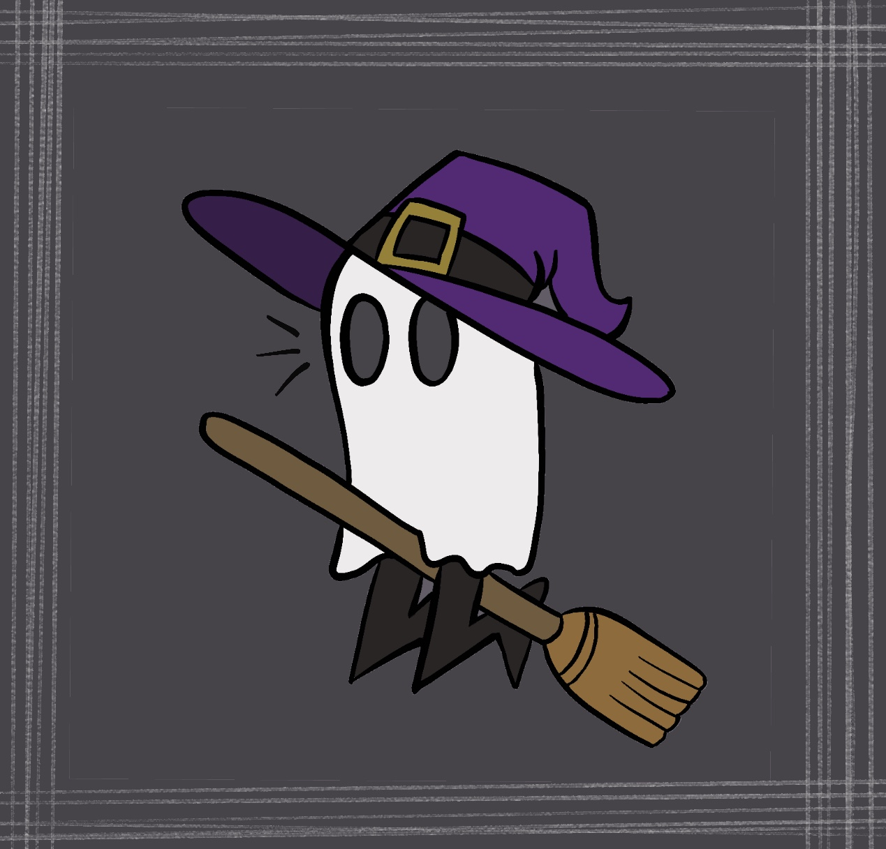

I do a lot of creative stuff that doesn't really have to do with coding or computer graphics! One of my favorite things to do is try new things and learn new skills, which leads to a lot of cool (but semi-irrelevant) side projects. But sometimes, even though it's not really relevant to my career path, I still want to show them off. So that's what this page is for! :)

Come back later to see what I've been up to!

# Zoom Doodles: May Update

As a TA for a hybrid class, I spend a lot of time holding office hours over Zoom. And sometimes I like to spice things up when everyone inevitably has their cameras off. My favorite part of getting to host my office hours on Zoom has been drawing a new profile picture for every month!

## April

## March

## February

## January

## December

## November

## October

It's been so much fun taking a creative break from my studies as a grad student and finding new ways to engage students when I might not be able to see them face-to-face.